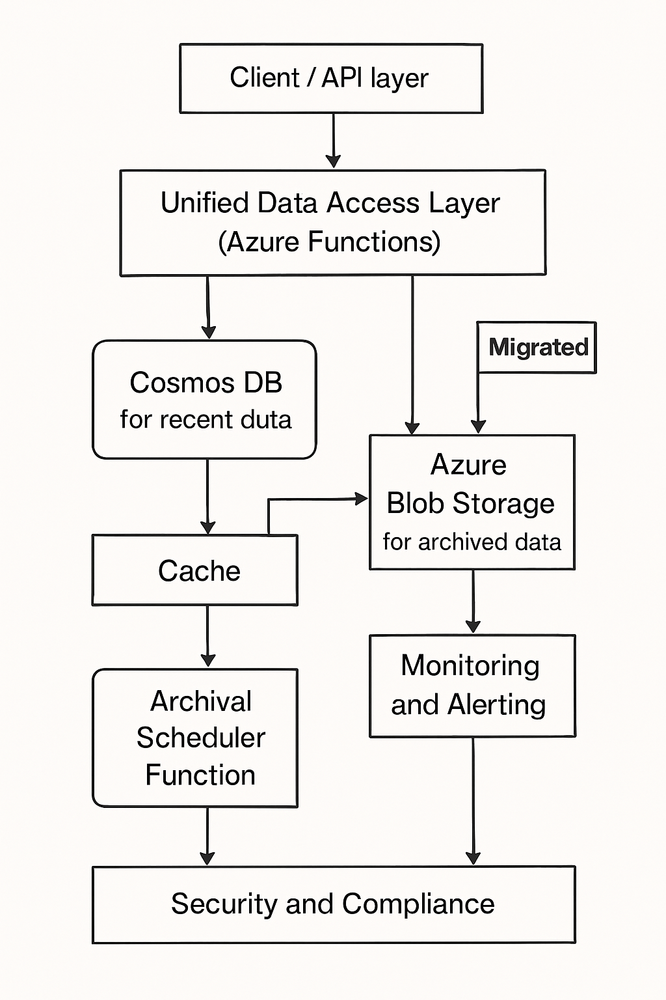

# Cost Optimization Challenge:

## **Managing Billing Records in Azure Serverless Architecture**

Here is a detailed production-ready architecture and solution for managing billing records in a cost-optimized Azure serverless system. This solution directly addresses the issues you might face in production, emphasizing Simplicity, No Data Loss & No Downtime, and No Changes to API Contracts.

## Architecture Overview

## Key Components

- **Client/API Layer**: Existing billing microservices (unchanged API contracts).
- **Unified Data Access Layer**: Azure Function (or lightweight library) orchestrating data retrieval/writes and hiding archival logic.
- **Cosmos DB**: Stores recent (≤3 months) billing records.
- **Azure Blob Storage**: Stores archived (>3 months) records in structured folders (e.g., by year/month).
- **Cache Layer (Optional, e.g. Azure Redis)**: Speeds up frequent access to archived records.
- **Archival Scheduler Function**: Periodic Azure Function that automates archival, ensures data consistency, and manages migration flags.
- **Monitoring & Alerting Subsystem**: Tracks failures, latency, and data consistency.
- **Security/Compliance Layer**: Applies strict RBAC, encryption, audit, and legal holds where needed.

## Architecture Diagram



## 1. Reads

- API requests flow through the Unified Data Access Layer.
- Recent records (<3 months): Pulled from Cosmos DB instantly.
- Older records: Not in Cosmos DB? Pulled from Cache (if available) or Azure Blob Storage; returned to user, with hit cached for future requests.
- Whole process is transparent—client endpoints do NOT change.

## 2. Writes/Updates

- Remain in Cosmos DB for ≤3 months.
- Archived records are strictly immutable—updates require copy-back to Cosmos, update operation, and re-archival, managed by the access layer.

## 3. Archival (Automated, Production-Safe)

- Scheduler scans Cosmos DB for records >3 months old that are not flagged as “migrating.”
- Each record is copied to Blob Storage using a two-phase process:
    1. Write to Blob and verify commit (hash/ETag).
    2. Mark record as “archived” (soft flag) in Cosmos.
    3. Background cleanup deletes confirmed records after a grace period, checking consistency logs.
- Migration is batched to avoid impacting service load.

## 4. Monitoring, Alerting, and Recovery

- Unified logs and metrics track migration states, error rates, and response times.
- Stuck, partial, or failed migrations are auto-logged, re-submitted, and flagged for operator review.
- Alerts are sent on anomalies: high archival failure, high read latency, unauthorized access.

## 5. Security & Compliance Controls

- Blob and Cosmos endpoints behind VNets/private endpoints.
- End-to-end encryption, RBAC, and access logs enforced.
- Optionally, add legal hold and data retention policies and support special-case records that should never be archived.

## Problem Prevention & Correction

| **Problem** | **Mitigation/Process** |
| --- | --- |
| Data loss/corruption during migration | Two-phase commit (copy & verify, then delete), migration logs, idempotent jobs |
| Concurrent access/updates during migration | “Migrating” flag in DB, access layer blocks/retries conflicting ops |
| High latency for archived reads | Blob Storage in hot/cool tier, Redis cache for recent archived “hits” |
| Query limitations on archived data | Primary key lookup only, optional index/metadata table for secondary fields |
| Schema evolution | Version field on record, versioned gateways for deserialization |
| Job failures/outages | Scheduler/Functions are idempotent, errors logged, auto-retry, alerting |
| Security gaps | RBAC, audit logs, firewalls, private endpoints, encryption, compliance review |
| Spike in old record access | Auto-scale access layer/caching, option to temporarily rehydrate to Cosmos DB |

## Ease of Implementation & Operational Simplicity

- Azure Functions and existing SDKs handle most business logic.
- Migration logic is small and can be tested independently.
- No API or client-side changes are required; all complexity is contained in server-side infra.
- Rollout can be staged: pilot migration, smoke testing, and then full activation.

## Example Pseudocode (Archival, Unified Read)

```python
def archive_records():
    for record in cosmosdb.find_old_records(months=3):
        if not record.is_archived:
            blob_storage.save(record.id, record.to_json())
            if blob_storage.verify(record.id):
                cosmosdb.flag_as_archived(record.id)
                # Actual delete may occur after N days/grace period
```

```python
def unified_read(record_id):
    record = cosmosdb.get(record_id)
    if not record or record.is_archived:
        record = cache.get(record_id) or blob_storage.read(record_id)
        if record: cache.set(record_id, record)
    return record
```

Hear is a conversation with GPT-4.1

[https://www.perplexity.ai/search/cost-optimization-challenge-ma-DkibmztNRmKiaXdDroqiiA](https://www.perplexity.ai/search/cost-optimization-challenge-ma-DkibmztNRmKiaXdDroqiiA)